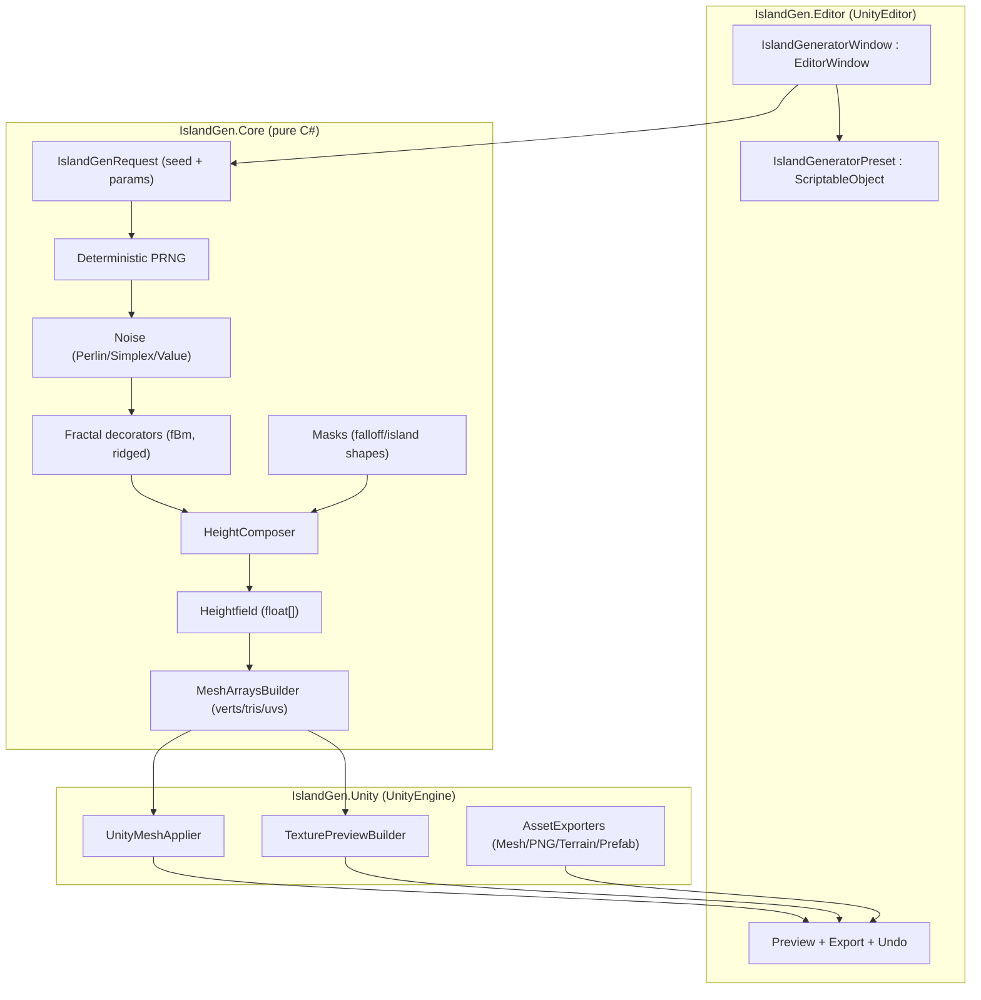

# Unity Editor Procedural Island Generator Research Report

## Executive summary

A flexible, reusable Unity editor procedural island generator is best built as a **three-layer system**: an editor-facing “tool shell” (EditorWindow + UX), a **pure generator core** (deterministic heightfield/noise/masks that returns plain arrays/structs), and a Unity-facing “adapter” layer (Mesh/Texture/Terrain/Asset export). This separation improves reusability across future projects, enables meaningful unit tests in EditMode, and keeps UnityEditor dependencies out of the core. citeturn2search4turn1search3turn1search7

For island shaping, raw noise alone tends to produce “terrain chunks,” not islands. Most practical island generation pipelines combine noise with an **island mask/falloff** that pushes borders down toward sea level. Red Blob Games’ island shaping write-up is a strong primary reference because it evaluates multiple mask families and shows why some produce better coastlines. citeturn0search2turn0search6turn0search26

For noise primitives, Unity’s built-in `Mathf.PerlinNoise` is the lowest-friction first step (2D noise in `[0,1]`), but you will likely want modular support for **fBm** (octaves/persistence/lacunarity), **ridged variants** (e.g., `1 - abs(noise)`), and optionally **Simplex** for smoother isotropy and fewer directional artifacts. Foundational sources: Ken Perlin’s “Improving Noise” (2002) and the GPU Gems chapter describing design/implementation decisions; Musgrave’s fractal terrain notes for fBm and hybrid multifractals; and Gustavson’s “Simplex Noise Demystified” for an implementer-friendly explanation of simplex. citeturn0search3turn2search2turn6view0turn6view2

Licensing/patents: if you ship a Simplex implementation, be explicit about third‑party code licenses. The well-known “Standard for perlin noise” patent associated with the simplex-style approach is shown as “Expired - Lifetime” on Google Patents (status information is not a legal conclusion, but is a strong signal that the historical patent risk is lower today). Treat this as a due‑diligence item for your studio anyway. citeturn9view0turn9view1

Editor UX and safe workflows should rely on Unity’s serialization and Undo systems rather than ad-hoc state. Unity’s `SerializedObject`/`SerializedProperty` pipeline automatically handles dirtying and integrates with Undo and prefab overrides; `Undo.RegisterCreatedObjectUndo` is essential when the tool spawns scene objects. citeturn1search4turn0search0turn5search18

Performance: heightfield resolution grows quadratically; mesh indices default to 16-bit (≈65k vertices limit) unless you set `mesh.indexFormat` to 32-bit (with platform caveats). For large worlds or future runtime use, consider chunking + LOD (LOD Group and/or Mesh LOD) and, when needed, Jobs/Burst with `Mesh.AllocateWritableMeshData` / `MeshDataArray` to move data creation off the main thread while applying to Unity objects on the main thread. citeturn10search0turn1search9turn1search36turn11search5turn11search1turn3search13turn3search1

Unity version is **unspecified**. This report cites Unity docs across multiple supported versions (including Unity 6.x pages); confirm API availability in your target Unity baseline during implementation. citeturn2search4turn1search16turn10search0turn11search5

## Architecture and implementation patterns

A reusable design goal suggests you avoid “EditorWindow does everything.” Instead, use a **functional core + imperative shell** structure:

* **Functional core**: deterministic generation from parameters → height array(s), masks, metadata; no UnityEditor; minimal UnityEngine (ideally none).
* **Imperative shell**: EditorWindow draws UI, manages selection/root objects, calls generator, creates/updates Mesh/Texture/Assets, handles Undo.

Unity strongly supports this separation in practice: editor windows are built by subclassing `EditorWindow`, while serialization/Undo integration is provided via `SerializedObject` + `SerializedProperty` when editing Unity objects (like ScriptableObjects). citeturn2search4turn1search4turn5search18

This needs to be built in such a way that it can be packaged as a unity asset that can be imported to other projects in the future

### Recommended assemblies and dependency boundaries

**Assembly layout (recommended)**

- `IslandGen.Core` (no UnityEditor; ideally no UnityEngine)
  - math, noise, masks, blending, deterministic PRNG
  - returns plain arrays/structs (`float[]`, `int[]`, small structs)

- `IslandGen.Unity` (UnityEngine ok; no UnityEditor)
  - mesh/texture builders and runtime API wrappers

- `IslandGen.Editor` (UnityEditor)
  - EditorWindow, preset asset creation, export menus, scene integration

This makes it possible to run most tests as EditMode “pure” tests with the Unity Test Framework. citeturn1search3turn1search7turn2search4

### Key abstractions for modularity and testability

Use composition instead of monolithic “GenerateIsland()” logic:

- **Noise interface**
  - `INoise2D.Sample(x, z) -> float`
  - implementations: Unity Perlin wrapper, Simplex (custom), Value noise, Worley (optional later)

- **Fractal decorator**
  - `FbmNoise(INoise2D baseNoise, octaves, lacunarity, persistence)`
  - `RidgedNoise(INoise2D baseNoise)` where ridged base is commonly `1 - abs(2*noise-1)` (or `1 - abs(noise)` depending on range)

Musgrave’s course notes provide canonical fBm construction and discuss heterogeneous/hybrid multifractal ideas (including ridged-like bases such as “one minus absolute value of Perlin noise”). citeturn7view3turn7view1turn6view0turn7view2

- **Mask interface**
  - `IMask2D.Evaluate(u, v) -> float` where `u,v ∈ [0,1]`
  - mask families (radial, square, “distance to edge”, “rounded square”, etc.) per Red Blob’s evaluation.

Red Blob’s island shaping study is specifically about these mask function tradeoffs and is highly actionable. citeturn0search2turn0search6

- **Combiner**
  - `HeightComposer` that combines noise layers + mask + sea level mapping
  - output: `Heightfield { width, height, float[] heights, min, max }`

- **Mesh builder**
  - `MeshDataBuilder.BuildGrid(heightfield, scale) -> MeshArrays`
  - `UnityMeshApplier.Apply(meshFilter, meshCollider, MeshArrays)` uses Unity `Mesh` APIs. citeturn0search5turn5search7turn10search9

### Architecture diagram



## Algorithms and terrain shaping toolkit

image_group{"layout":"carousel","aspect_ratio":"16:9","query":["2D Perlin noise heightmap visualization","island falloff mask visualization","ridged multifractal noise terrain heightmap","simplex noise texture visualization"],"num_per_query":1}

### Noise algorithms and recommended usage

**Unity Perlin (baseline)**  
Unity’s `Mathf.PerlinNoise(x, y)` provides 2D Perlin noise in `[0,1]` (Unity notes that generalized 3D Perlin is not implemented in that API). This is ideal for the first editor-tool pass and for quick iteration. citeturn5search0

**Improved Perlin (reference implementation insight)**  
Perlin’s “Improving Noise” (2002) and “Implementing Improved Perlin Noise” (GPU Gems) explain improvements in interpolation and gradient selection and emphasize a goal of a consistent, standard implementation. Even if you don’t directly port the reference code, these sources are valuable for understanding artifact sources and for validating your noise output against known-good behavior. citeturn0search3turn2search2

**Simplex (optional advanced primitive)**  
Gustavson’s write-up highlights that simplex has fewer directional artifacts and scales better in higher dimensions, with a continuous gradient that is cheap to compute. In practice for 2D island heightmaps, simplex can produce “less grid-aligned” features than classic Perlin, and is often a better underlying primitive when you later add domain warping and ridged features. citeturn6view2

**fBm (fractal Brownian motion) layering**  
Musgrave’s notes describe fBm as a spectral sum across “octaves,” with lacunarity controlling frequency gap and H/persistence controlling amplitude falloff. This is the standard way to introduce multi-scale detail while keeping control knobs that designers understand. citeturn7view3turn6view0

**Ridged / hybrid multifractal (mountain-like structure)**  
Musgrave describes hybrid multifractal constructions and explicitly notes using bases like “one minus the absolute value of Perlin noise” for ridge-like terrains (the idea behind “ridged noise” families). This is often the fastest way to get convincing mountainous ridges without running erosion. citeturn7view1turn7view2

**Domain warping (optional, high impact)**  
Musgrave’s notes and dissertation discuss domain distortion/warping as a tool to emulate larger-scale geomorphic effects; practically, modest warping can break up “too regular” fBm and generate more interesting coastline variation for islands. citeturn6view0turn6view1

### Falloff and island masks

Red Blob’s island shaping functions article is the most directly applicable discussion of how to push borders down and control coastal shape. It also compares multiple mask families rather than prescribing a single function. citeturn0search2

Recommended mask families (in practice):

- **Radial falloff**: based on distance from center; simplest “one island” control.
- **Distance-to-edge falloff**: treats edges more uniformly; often better for rectangular maps.
- **Rounded-square** or “superellipse” masks: give “gently squarish” islands (good for certain art directions).
- **Noise-perturbed mask**: generate the silhouette first, then apply terrain detail (also advocated by “separate shape from terrain” approaches in community discussion). citeturn0search2turn0search14

### Multi-island blending strategies

For archipelago mode, you want a blending operator that can create separated islands with channels.

Common approaches:

- **Max of masks**: `mask = max(mask_i)` gives distinct islands, strong separation, but can look “patchy” where masks overlap.
- **Sum + clamp**: `mask = saturate(sum(mask_i))` makes larger landmasses and merges more easily.
- **Smooth union** (SDF-style): produces natural merges and saddles; slightly more computation but still lightweight.
- **Voronoi region assignment**: choose nearest island center, apply a local mask; gives very clean island ownership boundaries, sometimes too artificial unless perturbed.

These are largely “operator design” decisions; keeping them as pluggable `IMultiMaskBlend` components makes the generator reusable.

### Optional river/channel hints

At your current stage, “rivers” emerging from below sea level are essentially **channels/inlets** created by the heightfield crossing the sea plane. Real drainage networks require flow routing. Musgrave’s dissertation explicitly notes the need for fluvial erosion to create context-sensitive drainage features, and that full simulations can be impractical compared to fBm-based models. citeturn6view1turn6view0

A pragmatic middle-ground for “river hints” (without full erosion):

- Compute a **flow direction** field from the heightmap (classic D8: each cell flows to the steepest downslope neighbor).
- Compute **flow accumulation** (count how much upstream area drains through each cell).
- Carve channels by subtracting a depth proportional to a function of accumulation, then re-smooth locally.

Hydrology literature (e.g., Tarboton) summarizes D8 as the common single-direction flow routing method and attributes it to O’Callaghan & Mark (1984). Red Blob’s river-growing experiments provide useful intuition and links to relevant papers. citeturn4search22turn4search0

### Comparison table of algorithm options and tradeoffs

| Category | Option | Complexity per sample | Visual characteristics | Determinism | License / IP notes |
|---|---|---|---|---|---|
| Base noise | Unity `Mathf.PerlinNoise` | O(1) | Smooth “waves,” can show grid-aligned artifacts depending on use | Deterministic for given input coords | Built-in Unity API; no external code to license citeturn5search0 |
| Base noise | Improved Perlin (Perlin 2002 / GPU Gems reference) | O(1) | Higher quality gradients/interpolation; artifact reduction | Deterministic | If you port code, follow its license/terms; use papers as reference citeturn0search3turn2search2 |
| Base noise | Simplex | O(1) (lower constant factors esp. for higher dimensions) | More isotropic, fewer directional artifacts; good gradients | Deterministic | Historical patent: “Standard for perlin noise” shows “Expired - Lifetime” on Google Patents; still validate legal posture and code license citeturn6view2turn9view0 |
| Fractal layering | fBm (octaves) | O(octaves) | Natural multi-scale detail; controllable roughness | Deterministic | Pure math; implementation license depends on your codebase citeturn7view3turn6view0 |
| Fractal layering | Ridged / hybrid multifractal | O(octaves) | Sharp ridges, mountainous structure without erosion | Deterministic | Pure math; described directly by Musgrave for terrain models citeturn7view1 |
| Shaping | Falloff/island masks | O(1) | Controls coastline and “islandness” strongly | Deterministic | Pure math; Red Blob provides tested patterns citeturn0search2 |
| Multi-island | Max / sum / smooth union blends | O(k) for k islands (or O(nearby centers) with spatial accel) | Controls merging vs separation; influences channel frequency | Deterministic | Pure math; keep operator pluggable |
| Channels | D8 + accumulation carving | O(n) for n cells (plus iterations) | Produces plausible drainage lines; can look synthetic without post-filters | Deterministic | Algorithm family well documented; beware edge cases (flats/sinks) citeturn4search22turn4search0 |

## Editor UX, serialization, and safe workflows

### EditorWindow and parameter authoring

Unity’s `EditorWindow` is the standard foundation for dockable tools, and can be opened via menu items (Unity docs explicitly mention `MenuItem` for configuring editor windows). citeturn2search4turn2search0

**Recommendation**: keep the window class focused on:
- loading/creating a preset asset
- drawing fields
- dispatching “Generate / Regenerate / Export”
- presenting preview + validation warnings

### ScriptableObject presets and serialized UI binding

ScriptableObjects persist data across editor sessions and are excellent for tool presets; Unity explicitly describes that changes made via editor authoring tools/inspector are written to disk and persist between sessions. citeturn1search16

For drawing and editing the preset, bind the preset with `SerializedObject` and draw via `SerializedProperty`. Unity notes that this system “automatically handle[s] dirtying individual serialized fields so they will be processed by the Undo system and styled correctly for Prefab overrides.” citeturn1search4

### Undo and “safe regeneration”

**Scene object creation**: when the generator first creates a root GameObject, register Undo using `Undo.RegisterCreatedObjectUndo`. Unity documents that this records object creation so the user can undo the create action. citeturn0search0

**Editing preset assets**:
- Prefer `SerializedObject` editing so Undo/dirty is handled automatically. Unity explicitly recommends the SerializedProperty system for editor UI to ensure dirtying + Undo + prefab overrides are handled. citeturn5search18turn1search4
- If you must modify fields directly (e.g., code-driven updates), use `Undo.RecordObject` before making changes; Unity documents that it diffs the object at end of frame and records changed properties. citeturn5search6
- If you intentionally do not want Undo entries but still need persistence, `EditorUtility.SetDirty` exists, and Unity’s doc clarifies when to use it vs Undo. citeturn5search18

**Mesh + collider regeneration**:
- Updating `MeshCollider.sharedMesh` can trigger collider rebuild; Unity explicitly says if vertices/indices/triangles changed prior to setting `sharedMesh`, collider shapes will be rebuilt. This can be expensive, so gate it behind a toggle (“Update Collider”) and avoid doing it on every slider change. citeturn10search9

### Preview and export UX

**Preview texture** (recommended early):
- Build a `Texture2D` height preview; call `SetPixels` (or bulk methods) and then `Apply` once. Unity notes `Apply` is expensive and copies all pixels, so batch changes before applying. citeturn10search3
- Optional: export the preview as PNG via `Texture2D.EncodeToPNG`. Unity documents that it returns PNG bytes suitable for writing to disk (with readability/format caveats). citeturn3search10turn10search3
- Use `EditorUtility.SaveFilePanelInProject` for selecting a save path inside Assets. citeturn3search2

**Mesh/asset exporting**:
- To save a generated mesh as a Unity asset, use `AssetDatabase.CreateAsset` (Unity doc: creates new native-format assets; overwrites if path exists; must use native extension such as `.asset`). citeturn2search9
- If you want multiple assets saved into the same `.asset` container (e.g., mesh + preview texture), `AssetDatabase.AddObjectToAsset` exists; Unity notes you can’t add GameObjects this way (use PrefabUtility instead). citeturn3search32turn2search9
- For saving the generated island object hierarchy as a prefab, `PrefabUtility.SaveAsPrefabAsset` creates a prefab asset at a path in Assets without modifying input objects. citeturn3search3
- Ensure you call `AssetDatabase.SaveAssets` when appropriate to flush changes. citeturn2search29

## Performance and profiling

### Mesh size, index formats, and chunking

Meshes default to 16-bit indices, which supports up to **65535 vertices**; Unity documents this along with the 32-bit option and warns that 32-bit index support is not guaranteed on all platforms (example given: some older Mali GPUs). This means a reusable generator should either chunk meshes or allow 32-bit indices with clear warnings. citeturn10search0turn10search4

Practical guidance:
- For editor-only tooling, 32-bit indices are typically fine for desktop iteration.
- For reuse in runtime/mobile projects, prefer chunking into tiles that each stay within 16-bit limits unless you explicitly accept the platform requirement.

### LOD strategies

Unity provides two “LOD features”: **Mesh LOD** and **LOD Group**, with different formats and use cases. citeturn11search5turn11search1

For a procedural island mesh, common approaches:
- **Chunk LOD**: generate multiple resolutions per chunk and manage via LOD Group.
- **Distance-based switching**: use `LODGroup.SetLODs` or author LOD levels in editor; `LODGroup` is intended to group renderers by screen-relative size. citeturn11search0turn11search12
- **Mesh LOD (newer pipeline)**: Unity exposes APIs like `Mesh.SetLods`/`GetLods` for mesh-level ranges. Keep this as optional optimization because projects on older Unity baselines may not rely on Mesh LOD APIs. citeturn11search2turn11search6

### Jobs/Burst and large-generation workflows

If generation becomes slow (large heightfields, multi-island, previews, collider rebuilds), use a two-phase compute model:
1) compute height arrays and mesh arrays off main thread (Jobs/Burst or Tasks with pure data),
2) apply to Unity objects on main thread.

Unity’s `Mesh.AllocateWritableMeshData` is explicitly designed for mesh creation using C# Jobs and states that mesh data structs can be accessed from any thread. Unity also notes allocating one MeshDataArray for multiple meshes is more efficient than repeated calls. citeturn1search9turn1search36turn1search1

Burst is a compiler that translates IL/.NET bytecode to optimized native code via LLVM and is designed to work efficiently with the Job system; Unity describes Burst as part of the HPC# subset and documents usage via `[BurstCompile]`. citeturn3search1turn3search13turn3search0

### Memory, GC, and profiling guidance

Profiling should be systematic: Unity emphasizes profiling to identify real bottlenecks rather than optimizing by guesswork. citeturn1search6

Instrumentation:
- `Profiler.BeginSample` / `Profiler.EndSample` can measure generator stages; Unity notes `BeginSample` is conditionally compiled away in non-development builds (zero overhead outside profiling contexts). citeturn11search7turn11search19

Memory:
- Unity provides both a Memory Profiler module and a dedicated Memory Profiler package workflow; Unity’s guidance explains what these tools show and how to use snapshots to compare memory usage. citeturn1search2turn1search10turn1search18

Hot spots common to this tool class:
- `Texture2D.Apply` is expensive; batch pixel writes. citeturn10search3
- `MeshCollider.sharedMesh` rebuilds collision shapes when mesh data has changed; update only when needed. citeturn10search9
- Avoid generating garbage in tight loops; allocate arrays once per generation and reuse buffers if you implement “live preview while dragging.”

## Phase plan with acceptance criteria and tests

Unity’s Test Framework supports both EditMode and PlayMode tests. For editor tooling and pure generation, prioritize **EditMode tests** using NUnit `[Test]` unless you need frame-yielding behavior. citeturn1search3turn1search7turn1search11

### Timeline flowchart for phases

```mermaid
flowchart LR
  A["Phase 0: scaffolding"] --> B["Phase 1: flat grid mesh"]
  B --> C["Phase 2: noise heightfield"]
  C --> D["Phase 3: sea level + classification"]
  D --> E["Phase 4: island falloff mask"]
  E --> F["Phase 5: better noise controls (fBm/ridged)"]
  F --> G["Phase 6: presets + deterministic regeneration + preview"]
  G --> H["Phase 7: multi-island archipelago blending"]
  H --> I["Phase 8: export + cleanup + performance options"]
```



### Phase details with actionable tasks

**Phase 0: scaffolding and boundaries**  
Suggested files/classes:
- `IslandGen.Core/IslandGenRequest.cs` (immutable parameter struct/record)
- `IslandGen.Core/Heightfield.cs` (`float[] Heights`, size, min/max)
- `IslandGen.Core/PRNG/DeterministicRandom.cs` (local RNG wrapper)
- `IslandGen.Editor/IslandGeneratorWindow.cs : EditorWindow` citeturn2search4
- `IslandGen.Editor/IslandGeneratorPreset.cs : ScriptableObject` citeturn1search16

Method responsibilities:
- `IslandGeneratorWindow`: load preset, draw UI, validate, dispatch generate.
- `IslandGeneratorPreset`: only serialized fields + validation ranges.
- `IslandGenRequest.FromPreset(preset)`: convert authoring data to core request.

Acceptance criteria:
- Window opens via menu item; preset asset can be created/assigned. citeturn2search4turn2search0
- No UnityEditor references exist in `IslandGen.Core` assembly.

Test ideas (EditMode):
- `IslandGenRequest` conversion produces identical values for a known preset.
- Deterministic RNG produces a known sequence for a seed (golden test).

---

**Phase 1: flat procedural grid mesh**  
Suggested files/classes:
- `IslandGen.Core/MeshArrays.cs` (verts, tris, uvs, normals optional)
- `IslandGen.Core/MeshArraysBuilder.cs`
- `IslandGen.Unity/UnityMeshApplier.cs`
  - uses `Mesh.SetVertices`, `Mesh.SetIndices`/`SetTriangles`, `RecalculateBounds`, `RecalculateNormals` as needed. citeturn5search7turn0search5

Method responsibilities:
- `MeshArraysBuilder.BuildFlatGrid(width, depth, resX, resZ)`
- `UnityMeshApplier.ApplyTo(meshFilter, meshCollider?, arrays)` citeturn0search5turn10search9

Acceptance criteria:
- Generate creates a single GameObject with MeshFilter/MeshRenderer.
- Regenerate updates the same object (no uncontrolled duplicates).
- Mesh topology is correct: `(resX+1)*(resZ+1)` vertices and `resX*resZ*2` triangles.

Test ideas (EditMode):
- Vertex/triangle counts for small known grids.
- UV range is within `[0,1]` and monotonic across axes.
- Indices in triangles are within vertex bounds (no out-of-range). citeturn0search5

Integration test idea:
- Create a scene in test, run generator once, assert exactly one root object exists, and its Mesh is non-null.

---

**Phase 2: single-noise heightfield (Unity Perlin baseline)**  
Suggested files/classes:
- `IslandGen.Core/Noise/INoise2D.cs`
- `IslandGen.Core/Noise/UnityPerlinNoise2D.cs` (adapter that calls `Mathf.PerlinNoise`) citeturn5search0
- `IslandGen.Core/HeightComposer.cs`

Method responsibilities:
- `UnityPerlinNoise2D.Sample(x,z)` returns `[0,1]` per Unity API. citeturn5search0
- `HeightComposer.GenerateHeightfield(request)` outputs heights in world units.

Acceptance criteria:
- Same seed + same parameters produces identical height arrays across runs (deterministic).
- Changing noise scale changes feature size (visible). citeturn5search0

Test ideas:
- Determinism test: hash of heights for a fixed request equals expected.
- Range test: heights are within expected min/max bounds (given multiplier mapping).
- Gradient sanity: adjacent cells don’t differ beyond a configured max for a “smooth” baseline (heuristic).

Determinism note:
- If you use UnityEngine.Random, isolate state: Unity exposes `Random.InitState` and `Random.state` (serializable) to preserve determinism. Prefer local RNG (`System.Random` or your own) to avoid global state side effects. citeturn5search1turn5search5

---

**Phase 3: sea level and classification (coastline channels)**  
Suggested files/classes:
- `IslandGen.Core/SeaLevelClassifier.cs`
  - `IsLand(height)`, `IsWater(height)` based on `seaLevel` threshold.

Method responsibilities:
- `HeightComposer` outputs heights that can be above/below sea level
- `MeshArraysBuilder` sets vertex y = height

Acceptance criteria:
- Sea level default is 0; raising sea level submerges more mesh; lowering exposes more land.
- Generator can optionally output a “land mask” texture for debugging.

Test ideas:
- Classification count test: for a known seed, number of land cells matches expected.
- Boundary test: height exactly == sea level is treated consistently (documented rule).

---

**Phase 4: island falloff mask**  
Suggested files/classes:
- `IslandGen.Core/Masks/IMask2D.cs`
- `IslandGen.Core/Masks/FalloffMasks.cs`
  - radial, distance-to-edge, rounded-square options

Method responsibilities:
- `FalloffMasks.Radial(u,v,params)` returns [0,1]
- `HeightComposer` combines: `height = noiseHeight - falloffStrength * falloffValue`

Acceptance criteria:
- For typical parameters, borders trend underwater and center trends above water.
- Mask parameters are exposed and have predictable effect per Red Blob’s mask families. citeturn0search2

Test ideas:
- Mask monotonicity: radial falloff increases with distance from center.
- Border guarantee: with strong enough falloff, edge ring heights are below sea level (for a synthetic constant noise input).

---

**Phase 5: better noise controls (fBm + ridged)**  
Suggested files/classes:
- `IslandGen.Core/Noise/FbmNoise2D.cs` (octaves/persistence/lacunarity)
- `IslandGen.Core/Noise/RidgedNoise2D.cs`
- `IslandGen.Core/Noise/DomainWarp2D.cs` (optional)

Method responsibilities:
- `FbmNoise2D.Sample(x,z)`: sum octaves, scale amplitude by persistence, frequency by lacunarity.
- `RidgedNoise2D.Sample(x,z)`: apply ridged transform; optionally feed into hybrid multifractal weighting.
- `DomainWarp2D`: offsets sample coordinates by a low-frequency noise field.

These patterns are directly aligned to Musgrave’s fBm and hybrid multifractal constructions (including ridged-like bases). citeturn7view3turn7view1turn6view0

Acceptance criteria:
- Octaves increase detail without changing macro silhouette too drastically.
- Ridged mode produces visible ridge lines vs. smooth hills.

Test ideas:
- Spectral test (heuristic): increasing octaves increases high-frequency variance.
- Determinism test across all noise modes.

---

**Phase 6: presets, deterministic regeneration, and preview**  
Suggested files/classes:
- `IslandGen.Editor/IslandGeneratorPreset.cs` (CreateAssetMenu optional)
- `IslandGen.Editor/PresetLibrary.cs` (optional list of presets)
- `IslandGen.Editor/IslandPreviewPanel.cs`
- `IslandGen.Unity/TexturePreviewBuilder.cs`

Method responsibilities:
- Preset editing uses `SerializedObject` / `SerializedProperty` for Undo + dirty. citeturn1search4turn5search18
- Preview builds a Texture2D (height/land mask) and updates it efficiently (`SetPixels` then `Apply` once). citeturn10search3

Acceptance criteria:
- “Randomize seed” changes output; “Regenerate” with same seed reproduces exact output.
- Preview updates on Generate; optional “Live preview while dragging” is gated and does not freeze editor.

Test ideas:
- Snapshot test: preview texture checksum for known seed/settings.
- Preset persistence test: edit preset, save, reload editor session simulation (where feasible) and confirm values persist (ScriptableObject persists). citeturn1search16

---

**Phase 7: archipelago (multi-island blending)**  
Suggested files/classes:
- `IslandGen.Core/Islands/IslandCenterGenerator.cs` (place island centers deterministically via PRNG)
- `IslandGen.Core/Masks/MultiIslandMask.cs`
- `IslandGen.Core/Masks/BlendOps.cs` (max/sum/smooth union)

Method responsibilities:
- Generate k island centers inside bounds with min separation.
- For each cell, compute per-center falloff and blend.

Acceptance criteria:
- Can generate 2–N islands; channels appear naturally between them with typical params.
- Blend operator switch changes merging behavior (max vs sum vs smooth union).

Test ideas:
- Center determinism: same seed yields same centers.
- Separation test: min distance constraint holds.

---

**Phase 8: export, cleanup, and performance options**  
Suggested files/classes:
- `IslandGen.Editor/Export/HeightmapExporter.cs` (PNG, raw)
- `IslandGen.Editor/Export/MeshAssetExporter.cs` (Unity mesh asset)
- `IslandGen.Editor/Export/TerrainExporter.cs` (optional Unity Terrain output)
- `IslandGen.Editor/Export/PrefabExporter.cs`

Key APIs and constraints:
- Save mesh asset: `AssetDatabase.CreateAsset` (+ `AssetDatabase.SaveAssets`). citeturn2search9turn2search29
- Add sub-assets: `AssetDatabase.AddObjectToAsset` (no GameObjects). citeturn3search32
- Save prefab: `PrefabUtility.SaveAsPrefabAsset`. citeturn3search3
- Heightmap to Terrain: `TerrainData.SetHeights` expects floats in `[0,1]` and uses `[y,x]` indexing; heightmap resolution is clamped to specific sizes. citeturn10search2turn10search14

Acceptance criteria:
- Exported mesh assets re-open correctly and can be reused in other scenes/projects.
- Optional Terrain export produces matching shape (within expected scaling differences).
- Optional performance: chunking respects vertex/index limits; `mesh.indexFormat` set to UInt32 only when needed and warned appropriately. citeturn10search0

Test ideas:
- Asset export test (EditMode): export mesh asset, reload with AssetDatabase, verify vertices count.
- Terrain export test: export to TerrainData, sample a few heights to match expected normalized heights. citeturn10search2turn10search14

## Interoperability, export, and coding-agent brief

### Interoperability guidelines

**Heightfield as the canonical interchange format**  
For reuse across projects (including non-Unity targets), treat the heightfield array as the canonical output:
- `float[] heights` in row-major order
- metadata: `width`, `height`, `cellSize`, `seaLevel`, `min/max`
- optional derived maps: land mask, slope, curvature, flow accumulation

This makes it easy to export:
- **PNG heightmap preview** using `Texture2D.EncodeToPNG` (tool-friendly) citeturn3search10
- **Unity Terrain** using `TerrainData.SetHeights` (engine-native; normalized heights) citeturn10search2
- **Mesh assets** using `AssetDatabase.CreateAsset` (engine-native geometry) citeturn2search9

**Mesh asset portability within Unity**  
Save meshes as `.asset` so they can be referenced by prefabs and scenes, and optionally use `AssetDatabase.AddObjectToAsset` to package related artifacts (preview textures, metadata ScriptableObjects) together. citeturn2search9turn3search32

**Runtime generation API (future-proofing)**  
Even if initial scope is Editor-only, ensure `IslandGen.Core` can be called at runtime. ScriptableObjects are readable at runtime (but editing/authoring is editor-centric); Unity describes runtime players as read-only for saved ScriptableObject assets. citeturn1search16

### Coding-agent constraints checklist

Non-negotiable constraints for the implementation agent:
- Separation of concerns: no UnityEditor dependency in core generator.
- Determinism: same request + seed → identical outputs (heightfield and mesh arrays).
- No global RNG side effects: prefer local PRNG; if UnityEngine.Random is used, isolate/set/restore `Random.state`. citeturn5search5turn5search1
- Mesh safety: respect index format limits; set `mesh.indexFormat` only when necessary and document platform caveats. citeturn10search0
- Undo-safe editing: use `SerializedObject`/`SerializedProperty` for presets where possible; use `Undo.RegisterCreatedObjectUndo` when creating objects. citeturn1search4turn0search0
- Small commits: one phase per PR; each phase has its own acceptance criteria and tests.

### Core routine pseudocode snippets

Heightfield generation (noise + mask + sea level shaping):

```text
function GenerateHeightfield(request):
  heights = new float[request.resX * request.resZ]
  for z in 0..resZ-1:
    for x in 0..resX-1:
      u = x / (resX-1)
      v = z / (resZ-1)

      // world coords (or normalized), include deterministic offsets from seed
      wx = (u * request.width)  + request.noiseOffsetX
      wz = (v * request.depth)  + request.noiseOffsetZ

      n = request.noise.Sample(wx * request.noiseScale, wz * request.noiseScale)
      n = ApplyFractalIfEnabled(n, request)             // fBm, ridged, etc.

      falloff = request.mask.Evaluate(u, v)             // [0..1]
      h = (n - request.falloffStrength * falloff) * request.heightMultiplier

      heights[z*resX + x] = h
  return Heightfield(resX, resZ, heights)
```

Falloff function (distance-to-edge example aligned with Red Blob style thinking):

```text
function DistanceToEdgeFalloff(u, v, exponent):
  dx = min(u, 1-u)
  dz = min(v, 1-v)
  d = min(dx, dz)              // 0 at edges, 0.5 at center-ish
  t = 1 - (d * 2)              // 1 at edges, 0 near center
  return pow(saturate(t), exponent)
```

Multi-island blending (smooth union-like weighting):

```text
function MultiIslandMask(u, v, centers, radius, blendK):
  // compute per-center "islandness" fields
  values = []
  for c in centers:
    du = u - c.u
    dv = v - c.v
    d = sqrt(du*du + dv*dv) / radius
    m = saturate(1 - d)        // simple radial mask
    values.add(m)

  // smooth blend (one option)
  mask = 0
  for m in values:
    mask += exp(blendK * m)
  mask = log(mask) / blendK
  return saturate(mask)
```

Mesh creation from heightfield (grid triangulation overview):

```text
function BuildMeshArrays(heightfield, cellSize):
  verts = new Vector3[(resX)*(resZ)]
  uvs   = new Vector2[(resX)*(resZ)]
  tris  = new int[(resX-1)*(resZ-1)*6]

  for z in 0..resZ-1:
    for x in 0..resX-1:
      i = z*resX + x
      y = heightfield.heights[i]
      verts[i] = (x*cellSize, y, z*cellSize)
      uvs[i] = (x/(resX-1), z/(resZ-1))

  t = 0
  for z in 0..resZ-2:
    for x in 0..resX-2:
      i0 = z*resX + x
      i1 = i0 + 1
      i2 = i0 + resX
      i3 = i2 + 1
      // two triangles: (i0,i2,i1) and (i1,i2,i3) (winding depends on Unity convention)
      tris[t++] = i0; tris[t++] = i2; tris[t++] = i1
      tris[t++] = i1; tris[t++] = i2; tris[t++] = i3

  return MeshArrays(verts, tris, uvs)
```

Suggested unit tests (EditMode) for core routines:

```text
it "is deterministic for same seed and params":
  req = FixedRequest(seed=123, resX=64, resZ=64, ...)
  h1 = GenerateHeightfield(req)
  h2 = GenerateHeightfield(req)
  assert hash(h1.heights) == hash(h2.heights)

it "falloff pushes edges lower than center for strong falloff":
  req = FixedRequest(noise=constant(0.5), falloffStrength=10, ...)
  hf = GenerateHeightfield(req)
  assert avg(edgeRing(hf)) < avg(centerRegion(hf))

it "mesh has correct vertex and triangle counts":
  hf = FlatHeightfield(resX=10, resZ=20)
  mesh = BuildMeshArrays(hf)
  assert len(mesh.verts) == 200
  assert len(mesh.tris) == (9*19*6)
```

### Copy-paste brief for a coding agent

```md
Build a reusable Unity editor procedural island generator (C#). Unity version unspecified.

Architecture (must):
- IslandGen.Core: pure deterministic generator producing Heightfield + MeshArrays (no UnityEditor).
- IslandGen.Unity: applies MeshArrays to UnityEngine.Mesh and builds preview textures.
- IslandGen.Editor: EditorWindow UI + presets + Undo + safe scene regeneration + export.

Editor UX:
- EditorWindow opened via MenuItem.
- Presets stored as ScriptableObject assets; edit via SerializedObject/SerializedProperty (Undo-safe).
- Buttons: Generate, Regenerate, Randomize Seed, Export (PNG heightmap, Mesh .asset, optional Prefab).
- Safe regeneration updates an existing root object (no uncontrolled duplicates).
- Optional: Update MeshCollider toggle (avoid frequent collider rebuilds).

Algorithm features (phased):
- Phase 1: flat grid mesh generation.
- Phase 2: Perlin noise heightfield (Unity Mathf.PerlinNoise baseline, deterministic seed offsets).
- Phase 3: sea level threshold (default 0) + land/water classification outputs.
- Phase 4: island falloff mask (radial + distance-to-edge; tunable exponent/strength).
- Phase 5: fBm (octaves/persistence/lacunarity) + ridged mode; optional domain warp.
- Phase 6: preset workflows + preview texture (SetPixels then Apply once).
- Phase 7: archipelago mode with k island centers and blend ops (max/sum/smooth union).
- Phase 8: export pipeline + performance options (chunking/LOD, Jobs/Burst optional).

Acceptance criteria (every phase):
- Deterministic: same seed + params => identical Heightfield and MeshArrays.
- Tests: at least 1–3 new EditMode tests per phase using Unity Test Framework.
- Separation: no UnityEditor use in Core.
- Mesh safety: handle >65k vertices (chunk or set Mesh.indexFormat with warnings).
- Undo: object creation registered (Undo.RegisterCreatedObjectUndo); preset edits undoable.

Deliverables:
- File/class structure matching the architecture.
- Phase-by-phase PRs with small diffs and clear tests.
```

Primary sources emphasized in this report include Unity documentation on EditorWindows, ScriptableObjects, SerializedObject/Undo, Mesh APIs, mesh index formats, Jobs/Burst, profiling; Red Blob Games on terrain-from-noise and island masks; Perlin’s 2002 paper and GPU Gems chapter; Musgrave’s fractal terrain notes and dissertation; and Gustavson’s simplex explanation. citeturn2search4turn1search16turn1search4turn0search0turn0search5turn10search0turn1search9turn3search1turn11search7turn0search2turn0search6turn0search3turn2search2turn6view0turn6view1turn6view2